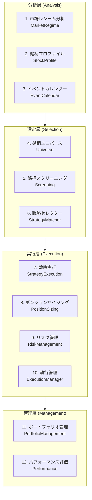
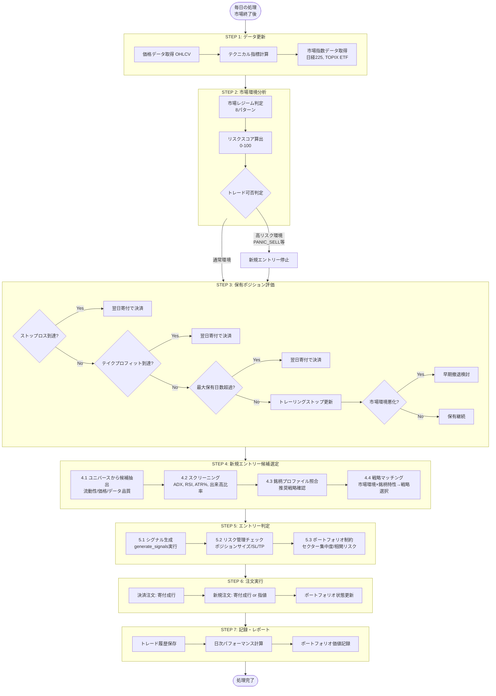
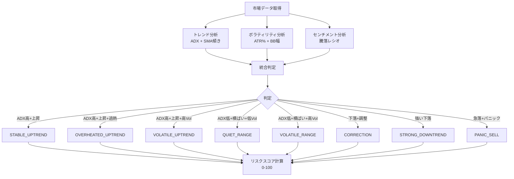
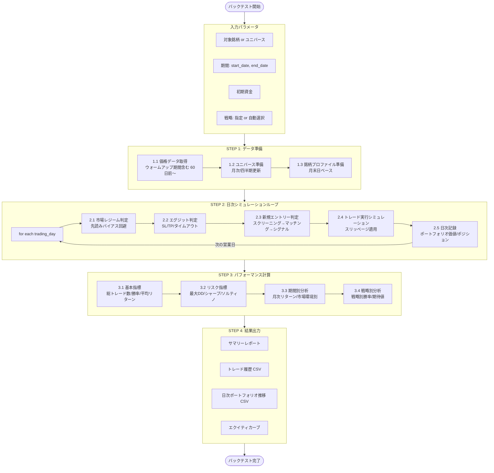
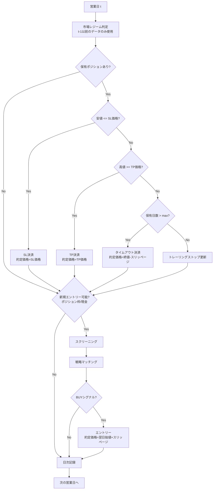
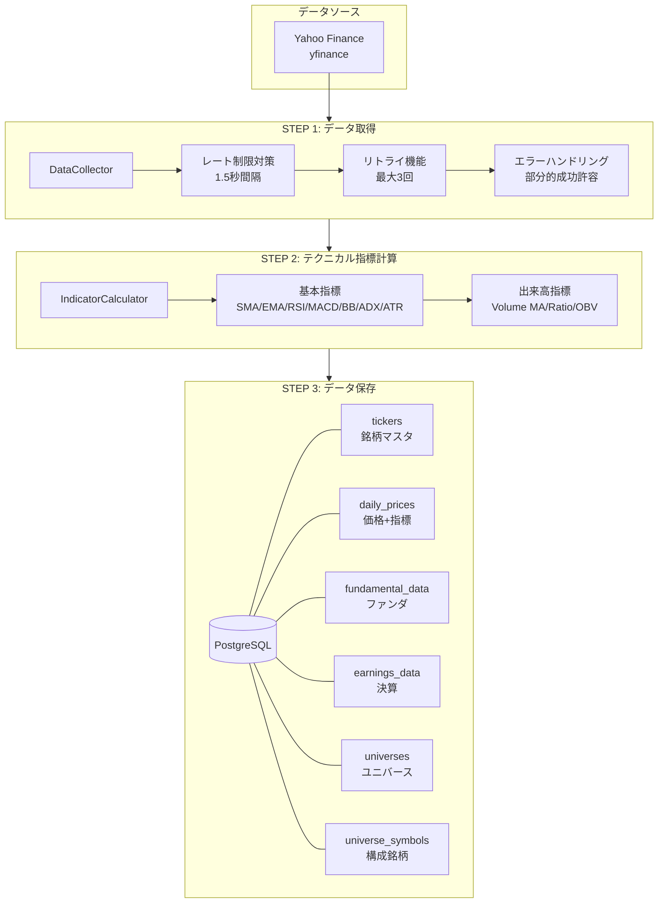
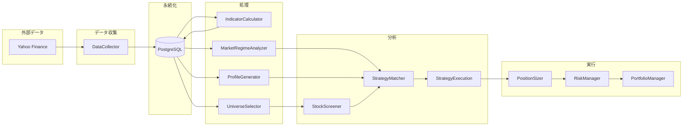
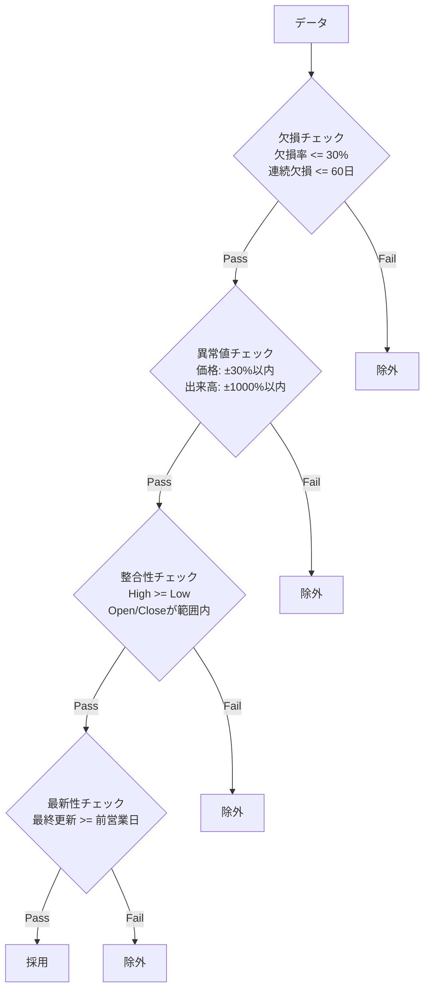
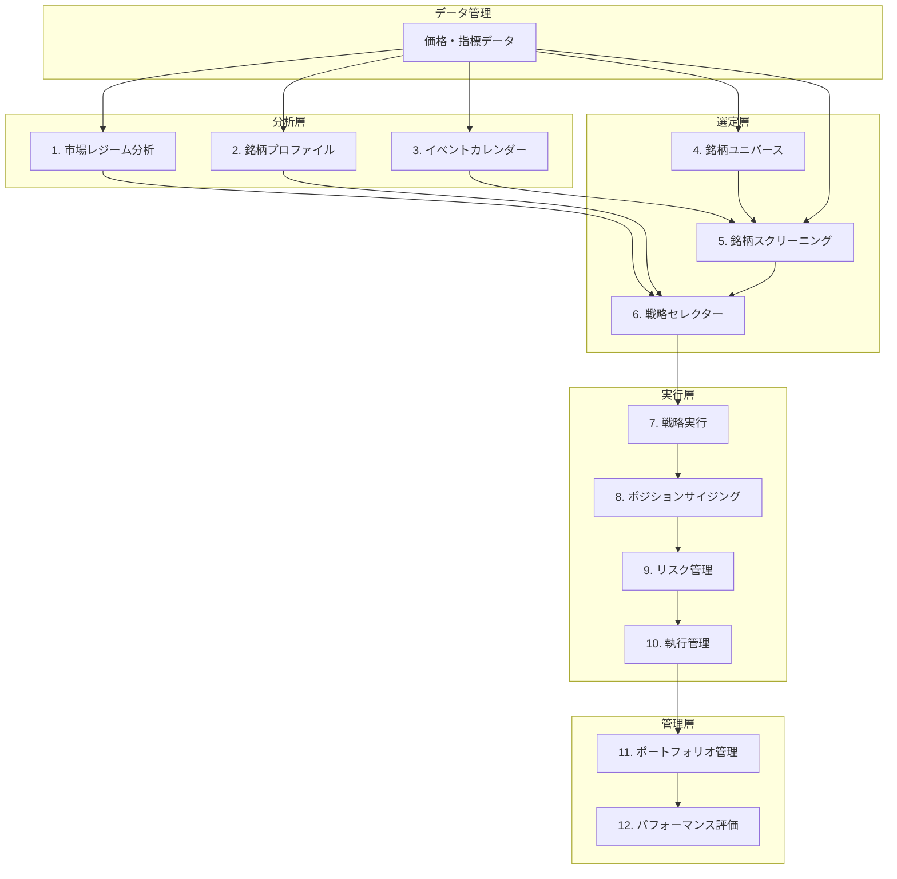
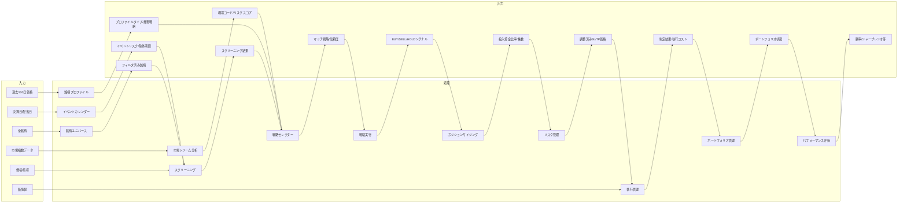

# スウィングトレードシステム アーキテクチャ・処理フロー

**最終更新**: 2025-12-02

---

## 1. システム構成要素

スウィングトレードシステムは以下の12要素で構成される。



### 各要素の責務

| # | 要素 | 責務 | 入力 | 出力 |
|---|------|------|------|------|
| 1 | 市場レジーム分析 | 市場全体の状態判定 | 市場指数の日足データ | 環境コード、リスクスコア |
| 2 | 銘柄プロファイル | 銘柄の長期特性分析 | 過去500日の日足データ | プロファイルタイプ、推奨戦略 |
| 3 | イベントカレンダー | 決算・SQ等のイベント管理 | 決算日、配当日、SQ日 | イベントリスクフラグ、除外期間 |
| 4 | 銘柄ユニバース | 取引対象の母集合定義 | 全銘柄の流動性データ | フィルタ済み銘柄リスト |
| 5 | 銘柄スクリーニング | テクニカル条件でのフィルタ | ユニバース銘柄、日足データ | テクニカル指標、スクリーニング結果 |
| 6 | 戦略セレクター | 銘柄×環境に適した戦略選択 | 市場環境、銘柄プロファイル、テクニカル指標 | マッチした戦略、信頼度 |
| 7 | 戦略実行 | エントリー/エグジットシグナル生成 | 日足データ、選択された戦略 | BUY/SELL/HOLDシグナル、SL/TP価格 |
| 8 | ポジションサイジング | 資金配分・株数決定 | 資金、リスク許容度、期待値 | 投入資金比率、株数 |
| 9 | リスク管理 | SL/TP設定、トレーリング | シグナル、ATR、ポジションサイズ | 調整済みSL/TP価格、トレーリング条件 |
| 10 | 執行管理 | 注文執行・スリッページ管理 | 注文情報、板情報 | 約定結果、執行コスト |
| 11 | ポートフォリオ管理 | 複数ポジションの統合管理 | ポジション群、現金残高 | ポートフォリオ状態 |
| 12 | パフォーマンス評価 | 収益率、リスク指標の計算 | トレード履歴、日次ポートフォリオ価値 | 勝率、シャープレシオ等 |

---

## 2. 実運用フロー

実運用（ライブトレード）における日次の処理フロー。

### 2.1 日次処理フロー図



### 2.2 市場レジーム判定フロー



### 2.3 実運用の判断基準

#### 市場レジーム別のアクション

| 市場環境 | 新規エントリー | 保有継続 | 推奨戦略 |
|---------|--------------|---------|---------|
| STABLE_UPTREND | ○ 積極的 | ○ | trend_follow, breakout |
| OVERHEATED_UPTREND | △ 慎重 | ○ トレーリング推奨 | defensive_long |
| VOLATILE_UPTREND | △ 慎重 | ○ SL拡大 | trend_follow |
| QUIET_RANGE | ○ | ○ | mean_reversion |
| VOLATILE_RANGE | △ 慎重 | △ | mean_reversion |
| CORRECTION | △ 底打ち確認後 | △ SL縮小 | bottom_fishing |
| STRONG_DOWNTREND | × 停止 | △ 早期撤退検討 | - |
| PANIC_SELL | × 停止 | × 即撤退 | - |

---

## 3. バックテストフロー

過去データを使った戦略検証のフロー。

### 3.1 バックテストフロー図



### 3.2 日次シミュレーション詳細



### 3.3 バックテストの種類

| 種類 | 対象 | 用途 | ファイル |
|------|------|------|---------|
| 単一銘柄バックテスト | 1銘柄 | 戦略のシグナル検証 | `strategy_backtester.py` |
| スコアベースバックテスト | 1銘柄 | スコアリングモデル検証 | `backtester.py` |
| ポートフォリオバックテスト | 複数銘柄 | 実運用シミュレーション | `portfolio_backtester.py` |
| バッチバックテスト | 複数銘柄×複数期間 | 大規模検証 | `batch_backtester.py` |

### 3.4 先読みバイアス回避


**先読みバイアス回避ルール:**

1. **データ使用制限**: 判定日(t)の分析には、t-1以前のデータのみ使用
2. **テクニカル指標**: 各日付時点で計算（将来データを含まない）
3. **銘柄プロファイル**: バックテスト用プロファイル（月末日ベース）を使用
4. **ユニバース**: 過去のユニバース構成を再現（サバイバーシップバイアス考慮）
5. **約定価格**: エントリーは翌日始値+スリッページ、エグジットは当日終値 or SL/TP価格

---

## 4. データ取得・管理フロー

### 4.1 データ取得フロー図



### 4.2 データフロー全体像



### 4.3 データ管理の仕組み

#### データ更新スケジュール

| データ種別 | 更新頻度 | タイミング | 保存期間 |
|-----------|---------|-----------|---------|
| 価格データ (OHLCV) | 日次 | 市場終了後 | 無期限 |
| テクニカル指標 | 日次 | 価格更新時 | 無期限 |
| ファンダメンタル | 週次/四半期 | 決算発表後 | 無期限 |
| ユニバース | 月次/四半期 | 月末 | 履歴保持 |
| 銘柄プロファイル | 月次 | 月末 | 履歴保持 |
| 市場レジーム | 日次 | 市場終了後 | キャッシュ |

#### データ品質チェック



### 4.4 設定ファイル管理

```mermaid
graph TD
    subgraph Config[config/]
        MR[market_regime/]
        PR[profiles/]
        SM[strategy_matcher/]
        US[universe_selector/]
        PB[portfolio_backtester/]
        ST[strategies/]
    end

    MR --> MR1[01_init.yml]
    MR --> MR2[02_enhanced.yml]
    MR --> MR3[03_multi_period_adr.yml]
    MR --> MRL[latest.yml → 03_multi_period_adr.yml]

    PR --> PRL[live/latest.yml]
    PR --> PRB[backtest/{symbol}/{date}.yml]

    SM --> SM1[01_init.yml]
    SM --> SM2[02_phase1_relaxed.yml]
    SM --> SML[latest.yml]

    US --> US1[01_init.yml]
    US --> USL[latest.yml]

    ST --> STN[{strategy_name}/latest.yml]
```

---

## 5. 要素間の依存関係

### 5.1 依存関係図



### 5.2 情報の流れ



### 5.3 情報フロー表

| From | To | 情報 |
|------|-----|------|
| データ管理 | 市場レジーム分析 | 市場指数の日足データ |
| データ管理 | 銘柄プロファイル | 過去500日の日足データ |
| データ管理 | イベントカレンダー | 決算日、配当日、SQ日 |
| データ管理 | 銘柄ユニバース | 全銘柄の流動性データ |
| データ管理 | 銘柄スクリーニング | 日足データ（価格、出来高） |
| 市場レジーム分析 | 戦略セレクター | 環境コード、リスクスコア |
| 銘柄プロファイル | 戦略セレクター | プロファイルタイプ、推奨戦略 |
| イベントカレンダー | 銘柄スクリーニング | イベントリスクフラグ、除外期間 |
| 銘柄ユニバース | 銘柄スクリーニング | 対象銘柄リスト |
| 銘柄スクリーニング | 戦略セレクター | テクニカル指標（ADX, RSI, ATR%等） |
| 戦略セレクター | 戦略実行 | 選択された戦略、信頼度 |
| データ管理 | 戦略実行 | 日足データ（シグナル生成用） |
| 戦略実行 | ポジションサイジング | BUYシグナル、SL/TP価格、期待値 |
| ポジションサイジング | リスク管理 | 投入資金比率、株数 |
| リスク管理 | 執行管理 | 調整済みSL/TP価格、トレーリング条件 |
| データ管理 | 執行管理 | 板情報、流動性データ |
| 執行管理 | ポートフォリオ管理 | 約定結果、執行コスト |
| ポートフォリオ管理 | パフォーマンス評価 | トレード履歴、日次ポートフォリオ価値 |

---

## 6. 補足: 主要クラス対応表

| 構成要素 | 主要クラス | ファイルパス | 実装状況 |
|---------|-----------|-------------|----------|
| 市場レジーム分析 | `MarketRegimeAnalyzer` | `src/services/market_regime/market_regime_analyzer.py` | 実装済み |
| 銘柄プロファイル | `ProfileMatcher`, `ProfileGenerator` | `src/services/profile/` | 実装済み |
| イベントカレンダー | `EventCalendar` | 未実装 | **未実装** |
| 銘柄ユニバース | `UniverseSelector` | `src/services/universe_selector/universe_selector.py` | 実装済み |
| 銘柄スクリーニング | `StockScreener`, `MarketAwareScreener` | `src/services/stock_screener/`, `src/services/market_aware_screening/` | 実装済み |
| 戦略セレクター | `StrategyMatcher` | `src/services/strategy_matcher/strategy_matcher.py` | 実装済み |
| 戦略実行 | `BaseSwingStrategy`, 各戦略クラス | `src/services/strategies/` | 実装済み |
| ポジションサイジング | `PositionSizer` | `src/services/trading/position_sizer.py` | 実装済み（Kelly基準未対応） |
| リスク管理 | `RiskManager`, `ExitManager` | `src/services/trading/` | 実装済み |
| 執行管理 | `ExecutionManager` | 未実装 | **未実装** |
| ポートフォリオ管理 | `PortfolioManager` | `src/services/trading/portfolio_manager.py` | 実装済み |
| パフォーマンス評価 | `PortfolioMetricsCalculator` | `src/services/portfolio_backtester.py` | 実装済み |

---

## 7. 関連ドキュメント

- [コンポーネント検証ガイド](./component-validation.md) - 各要素の検証方法とパラメータ最適化手順
- [コンポーネント入出力定義](./component-io-definitions/) - 各要素の入出力データ仕様
  - [市場レジーム分析](./component-io-definitions/01-market-regime.md)

---

**最終更新**: 2025-12-02
