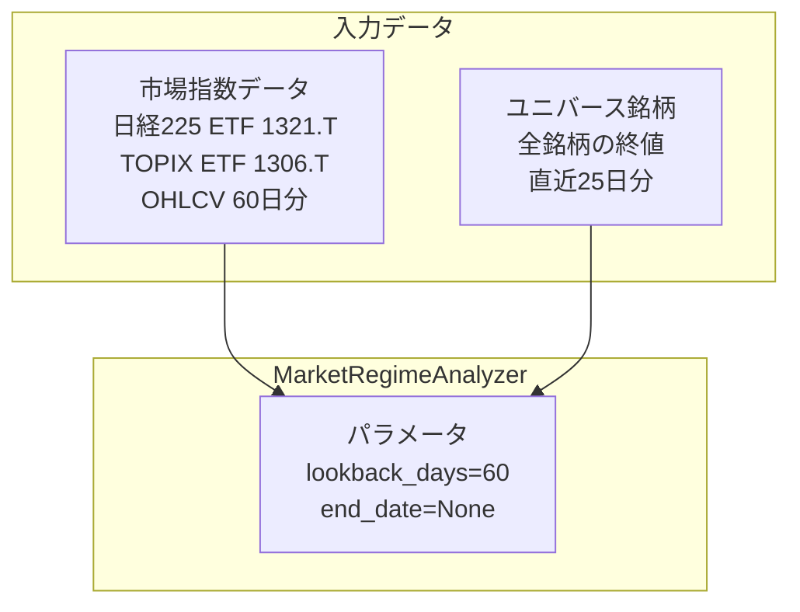
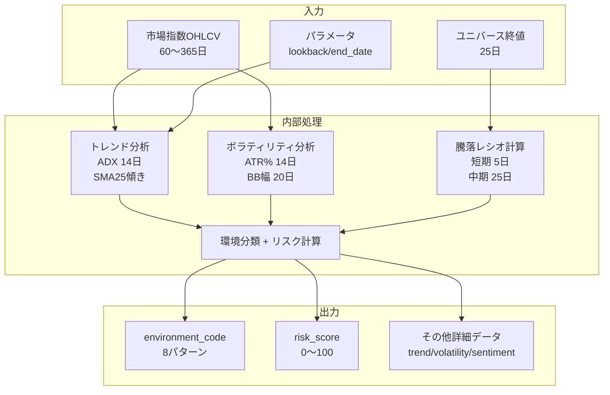

# 市場レジーム分析：入出力定義

**最終更新**: 2025-12-02

---

## 1. 入力（Input）

### 1.1 必須入力データ

| データ種別 | 具体的なデータ | 形式 | 必須/任意 | 用途 |
|-----------|--------------|------|----------|------|
| **市場指数価格** | 日経225 ETF (1321.T) | OHLCV日足 | 必須 | トレンド・ボラティリティ分析 |
| | TOPIX ETF (1306.T) | OHLCV日足 | 必須 | センチメント分析・補完 |
| **ユニバース銘柄価格** | 全ユニバース銘柄 | 終値日足 | 必須 | 騰落レシオ自己計算用 |
| **分析期間** | lookback_days | 整数 | 任意 | デフォルト60日 |
| **基準日** | end_date | 日付 | 任意 | バックテスト時に指定 |

### 1.2 データ詳細要件

#### 市場指数データ（OHLCV）

```
必要項目:
├─ Open（始値）
├─ High（高値）
├─ Low（安値）
├─ Close（終値）
└─ Volume（出来高）

必要期間:
├─ 最低: 60日分
├─ 推奨: 90日分以上
└─ 最大: 365日分

品質要件:
├─ 欠損率: 10%以下
└─ 連続欠損: 5日以下
```

#### ユニバース銘柄データ（騰落レシオ計算用）

```
必要項目:
└─ Close（終値）のみ

必要期間:
├─ 短期ADR用: 直近5日分
└─ 中期ADR用: 直近25日分

計算方法:
├─ 上昇銘柄: 終値 > 前日終値
├─ 下降銘柄: 終値 < 前日終値
└─ ADR = (上昇銘柄数 / 下降銘柄数) × 100
```

### 1.3 パラメータ入力

| パラメータ | 型 | デフォルト | 範囲 | 説明 |
|-----------|-----|-----------|------|------|
| lookback_days | int | 60 | 60〜365 | 分析対象期間 |
| end_date | date | None | - | 分析基準日（None=最新） |

### 1.4 入力データフロー図



---

## 2. 出力（Output）

### 2.1 出力データ構造

```
MarketRegime
├── トレンド分析
│   ├── trend_type: TRENDING / RANGING / NEUTRAL
│   ├── trend_direction: UPTREND / DOWNTREND / SIDEWAYS
│   ├── adx_value: float (0〜100)
│   └── adx_interpretation: str
│
├── ボラティリティ分析
│   ├── volatility_level: LOW / NORMAL / ELEVATED / HIGH
│   ├── atr_percent: float (%)
│   ├── bollinger_band_width: float (%)
│   └── volatility_consensus: bool
│
├── センチメント分析
│   ├── sentiment: POSITIVE / NEUTRAL / NEGATIVE
│   ├── nikkei_trend: UPTREND / DOWNTREND / SIDEWAYS
│   └── topix_trend: UPTREND / DOWNTREND / SIDEWAYS
│
├── 環境分類
│   └── environment_code: 8パターン（下記参照）
│
├── リスク評価
│   ├── risk_level: LOW / MEDIUM / HIGH / EXTREME
│   └── risk_score: int (0〜100)
│
└── 市場ブレッドス
    ├── advancing_declining_ratios: Dict[str, float]
    └── adr_divergence: bullish / bearish / neutral
```

### 2.2 環境分類（8パターン）

| コード | 日本語名 | トレンド | ボラティリティ | ADR状態 |
|--------|---------|---------|--------------|---------|
| STABLE_UPTREND | 健全な上昇 | 上昇 | 低〜通常 | 正常 |
| OVERHEATED_UPTREND | 過熱上昇 | 上昇 | - | 買われ過ぎ |
| VOLATILE_UPTREND | 荒れた上昇 | 上昇 | 高 | - |
| QUIET_RANGE | 静かなレンジ | 横ばい | 低 | - |
| VOLATILE_RANGE | 荒れたレンジ | 横ばい | 高 | - |
| CORRECTION | 調整局面 | 下落 | 通常 | - |
| STRONG_DOWNTREND | 本格下降 | 強い下落 | - | - |
| PANIC_SELL | パニック売り | 急落 | 高 | パニック水準 |

### 2.3 リスクスコア計算式

```
risk_score = トレンド(40点) + ボラティリティ(30点) + ADR(30点) ± 調整(5点)

【トレンド方向】40点配点
  DOWNTREND  → +40点
  SIDEWAYS   → +20点
  UPTREND    → +0点

【ボラティリティ】30点配点
  HIGH       → +30点
  ELEVATED   → +20点
  NORMAL     → +10点
  LOW        → +0点

【ADR】30点配点
  パニック水準 → +30点
  売られ過ぎ   → +15点
  正常範囲     → +0点

【ダイバージェンス調整】
  Bullish(短期>中期) → -5点
  Bearish(短期<中期) → +5点

【リスクレベル判定】
  0〜25点   → LOW
  26〜50点  → MEDIUM
  51〜75点  → HIGH
  76〜100点 → EXTREME
```

### 2.4 出力利用先

| 出力項目 | 利用先コンポーネント | 利用目的 |
|---------|-------------------|---------|
| environment_code | 戦略セレクター | 環境に適した戦略選択 |
| risk_level | ポートフォリオ管理 | エントリー可否判断 |
| risk_score | リスク管理 | ポジションサイズ調整 |
| volatility_level | 戦略実行 | SL/TP幅調整 |
| adr_divergence | 戦略セレクター | 反転タイミング示唆 |

---

## 3. 入出力関係図



---

## 4. 設定可能パラメータ一覧

| カテゴリ | パラメータ | デフォルト | 説明 |
|---------|-----------|-----------|------|
| **トレンド** | adx_trending_threshold | 25 | トレンド判定閾値 |
| | adx_ranging_threshold | 20 | レンジ判定閾値 |
| | sma_slope_uptrend | 0.06 | 上昇判定（%/日） |
| | sma_slope_downtrend | -0.06 | 下降判定（%/日） |
| **ボラティリティ** | atr_low_threshold | 0.8 | ATR%低閾値 |
| | atr_normal_threshold | 2.0 | ATR%通常上限 |
| | atr_elevated_threshold | 3.0 | ATR%高上限 |
| **ADR短期** | period | 5 | 期間（日） |
| | panic | 60 | パニック閾値 |
| **ADR中期** | period | 25 | 期間（日） |
| | panic | 50 | パニック閾値 |

---

**最終更新**: 2025-12-02
