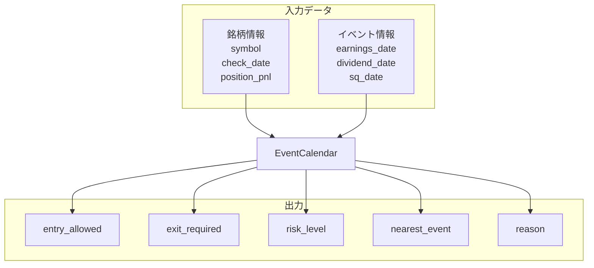

# イベントカレンダー：入出力定義

**最終更新**: 2025-12-11

---

## 1. 入力（Input）

### 1.1 必須入力データ

| データ種別 | 具体的なデータ | 形式 | 必須/任意 | 用途 |
|-----------|--------------|------|----------|------|
| **銘柄コード** | symbol | str | 必須 | 対象銘柄特定 |
| **判定日** | check_date | date | 必須 | イベントとの距離計算 |
| **決算発表日** | earnings_date | date | 任意 | 決算リスク判定 |
| **配当権利確定日** | ex_dividend_date | date | 任意 | 配当落ちリスク判定 |
| **含み損益率** | position_pnl | float | 任意 | 決算跨ぎ判定（保有時のみ） |

### 1.2 データ詳細要件

```
データソース:
├─ 決算日: Yahoo Finance (yfinance) earnings_dates
├─ 配当日: Yahoo Finance (yfinance)
└─ SQ日: 毎月第2金曜（計算で導出）
```

### 1.3 パラメータ入力

| パラメータ | 型 | デフォルト | 範囲 | 説明 |
|-----------|-----|-----------|------|------|
| earnings_exclude_before | int | 2 | 1〜5 | 決算前除外日数 |
| earnings_exclude_after | int | 1 | 0〜3 | 決算後除外日数 |
| earnings_cross_threshold | float | 8.0 | 0〜20 | 決算跨ぎ許容の含み益閾値（%） |

---

## 2. 出力（Output）

### 2.1 出力データ構造

```
EventCalendarResult
├── entry_allowed: bool          # 新規エントリー可否
├── exit_required: bool          # 強制決済要否
├── risk_level: NONE / LOW / MEDIUM / HIGH / CRITICAL
├── nearest_event: {
│     type: str,                 # "earnings" / "dividend" / "sq"
│     date: date,
│     days_until: int
│   }
└── reason: str                  # 判定理由
```

### 2.2 除外ルール

| イベント | 除外期間 | リスクレベル |
|---------|---------|-------------|
| 決算発表 | 発表日-2日〜+1日 | CRITICAL |
| 配当権利確定 | 権利付最終日のみ | MEDIUM |
| SQ日 | 当日（寄付き注意） | LOW |

### 2.3 決算跨ぎ判定

| 含み損益 | 判定 |
|---------|------|
| +8%以上 | 跨ぎ許容 |
| +8%未満 | 前日決済推奨 |

### 2.4 出力利用先

| 出力項目 | 利用先コンポーネント | 利用目的 |
|---------|-------------------|---------|
| entry_allowed | 銘柄スクリーニング | エントリー候補除外 |
| exit_required | ポートフォリオ管理 | 決算前決済判断 |
| risk_level | 戦略セレクター | 信頼度調整 |

---

## 3. 入出力関係図



---

## 4. 設定可能パラメータ一覧

| カテゴリ | パラメータ | デフォルト | 説明 |
|---------|-----------|-----------|------|
| **決算** | exclude_before | 2 | 発表前除外日数 |
| | exclude_after | 1 | 発表後除外日数 |
| | cross_threshold | 8.0 | 跨ぎ許容の含み益閾値（%） |
| **配当** | exclude_days | 1 | 権利付最終日の除外 |

---

## 5. 関連ファイル

| 種別 | パス |
|------|------|
| 実装 | `src/domain/services/analysis/event_calendar.py` |
| 設定 | `config/event_calendar/latest.yml` |
| テスト | `tests/unit/domain/services/analysis/test_event_calendar.py` |

---

**最終更新**: 2025-12-11
