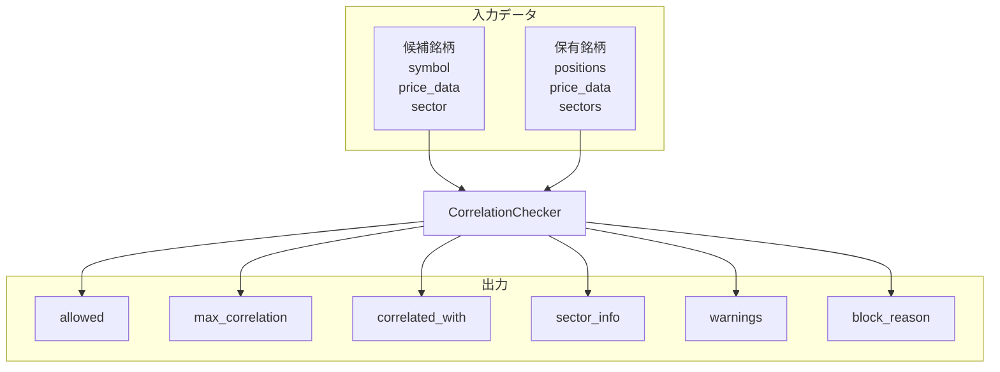

# 銘柄間相関チェック：入出力定義

**最終更新**: 2025-12-11

---

## 1. 入力（Input）

### 1.1 必須入力データ

| データ種別 | 具体的なデータ | 形式 | 必須/任意 | 用途 |
|-----------|--------------|------|----------|------|
| **候補銘柄** | candidate_symbol | str | 必須 | 相関計算対象 |
| **保有銘柄** | current_positions | List[str] | 必須 | 相関比較対象 |
| **価格データ** | price_data | Dict[str, DataFrame] | 必須 | リターン計算 |
| **セクター情報** | sector_map | Dict[str, str] | 任意 | セクター集中度 |

### 1.2 データ詳細要件

```
価格データ:
├─ 必要期間: 60日分
├─ 必要項目: Close（終値）
└─ 品質要件: 欠損率10%以下
```

### 1.3 パラメータ入力

| パラメータ | 型 | デフォルト | 範囲 | 説明 |
|-----------|-----|-----------|------|------|
| lookback_days | int | 60 | 20〜120 | 相関計算期間 |
| correlation_warning | float | 0.7 | 0.5〜0.9 | 警告閾値 |
| correlation_block | float | 0.8 | 0.6〜0.95 | 禁止閾値 |
| max_sector_count | int | 2 | 1〜3 | 同一セクター上限 |

---

## 2. 出力（Output）

### 2.1 出力データ構造

```
CorrelationCheckResult
├── allowed: bool                # エントリー可否
├── max_correlation: float       # 最大相関係数
├── correlated_with: str | None  # 最も相関の高い銘柄
├── sector_info: {
│     candidate_sector: str,
│     sector_count: int,
│     sector_positions: List[str]
│   }
├── warnings: List[str]          # 警告メッセージ
└── block_reason: str | None     # 禁止理由
```

### 2.2 判定基準

| 条件 | 結果 |
|------|------|
| 相関 < 0.7 | 許可 |
| 0.7 <= 相関 < 0.8 | 許可（警告付き） |
| 相関 >= 0.8 | 禁止 |
| 同一セクター >= 2 | 禁止 |

### 2.3 出力利用先

| 出力項目 | 利用先コンポーネント | 利用目的 |
|---------|-------------------|---------|
| allowed | 銘柄スクリーニング | エントリー候補フィルタ |
| max_correlation | 戦略セレクター | 信頼度調整 |
| warnings | ポートフォリオ管理 | リスクレポート |

---

## 3. 入出力関係図



---

## 4. 設定可能パラメータ一覧

| カテゴリ | パラメータ | デフォルト | 説明 |
|---------|-----------|-----------|------|
| **相関** | lookback_days | 60 | 相関計算期間 |
| | warning_threshold | 0.7 | 警告閾値 |
| | block_threshold | 0.8 | 禁止閾値 |
| **セクター** | max_same_sector | 2 | 同一セクター上限 |

---

## 5. 関連ファイル

| 種別 | パス |
|------|------|
| 実装 | `src/domain/services/selection/correlation_checker.py` |
| 設定 | `config/correlation_checker/latest.yml` |
| テスト | `tests/unit/domain/services/selection/test_correlation_checker.py` |

---

**最終更新**: 2025-12-11
