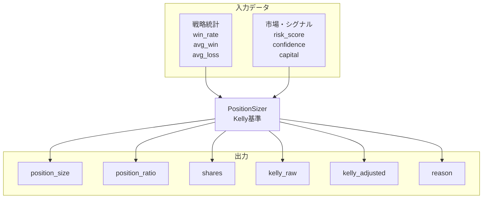

# ポジションサイジング（Kelly基準）：入出力定義

**最終更新**: 2025-12-11

---

## 1. 入力（Input）

### 1.1 必須入力データ

| データ種別 | 具体的なデータ | 形式 | 必須/任意 | 用途 |
|-----------|--------------|------|----------|------|
| **利用可能資金** | capital | int | 必須 | サイズ計算ベース |
| **戦略統計** | strategy_stats | StrategyStats | 必須 | Kelly係数計算 |
| **シグナル信頼度** | signal_confidence | float | 必須 | 調整係数 |
| **市場リスクスコア** | market_risk_score | int | 必須 | 調整係数 |
| **現在保有数** | current_positions | int | 必須 | 枠制限 |
| **株価** | stock_price | float | 必須 | 株数計算 |

### 1.2 戦略統計（StrategyStats）

```
StrategyStats
├── win_rate: float          # 勝率（0〜1）
├── avg_win: float           # 平均利益率（%）
├── avg_loss: float          # 平均損失率（%）
└── trade_count: int         # サンプルトレード数
```

### 1.3 パラメータ入力

| パラメータ | 型 | デフォルト | 範囲 | 説明 |
|-----------|-----|-----------|------|------|
| kelly_fraction | float | 0.5 | 0.25〜1.0 | Kelly係数の適用割合 |
| min_position_ratio | float | 0.10 | 0.05〜0.20 | 最小ポジション比率 |
| max_position_ratio | float | 0.25 | 0.15〜0.40 | 最大ポジション比率 |
| max_positions | int | 4 | 2〜6 | 最大保有銘柄数 |
| min_sample_trades | int | 30 | 10〜50 | 信頼できる最小サンプル数 |

---

## 2. 出力（Output）

### 2.1 出力データ構造

```
PositionSizeResult
├── position_size: int           # 投入金額（円）
├── position_ratio: float        # 資金比率（0〜1）
├── shares: int                  # 株数
├── kelly_raw: float             # 生のKelly係数
├── kelly_adjusted: float        # 調整後Kelly係数
└── reason: str                  # 計算過程の説明
```

### 2.2 Kelly係数計算式

```
Kelly% = W - (1-W)/R

W = 勝率
R = 平均利益/平均損失（リスクリワード比）

調整:
├─ Half-Kelly適用（×0.5）
├─ サンプル数調整（trade_count/30）
├─ 市場リスク調整（1 - risk_score/200）
└─ シグナル信頼度調整
```

### 2.3 出力利用先

| 出力項目 | 利用先コンポーネント | 利用目的 |
|---------|-------------------|---------|
| position_size | 執行管理 | 注文金額決定 |
| shares | 執行管理 | 注文株数決定 |
| position_ratio | リスク管理 | SL金額計算 |

---

## 3. 入出力関係図



---

## 4. 設定可能パラメータ一覧

| カテゴリ | パラメータ | デフォルト | 説明 |
|---------|-----------|-----------|------|
| **Kelly** | kelly_fraction | 0.5 | Kelly係数の適用割合 |
| | min_sample_trades | 30 | 信頼できる最小サンプル数 |
| **ポジション** | min_ratio | 0.10 | 最小ポジション比率 |
| | max_ratio | 0.25 | 最大ポジション比率 |
| | max_positions | 4 | 最大保有銘柄数 |

---

## 5. 関連ファイル

| 種別 | パス |
|------|------|
| 実装 | `src/domain/services/execution/position_sizing.py` |
| 設定 | `config/position_sizing/latest.yml` |
| テスト | `tests/unit/domain/services/execution/test_position_sizing.py` |

---

**最終更新**: 2025-12-11
