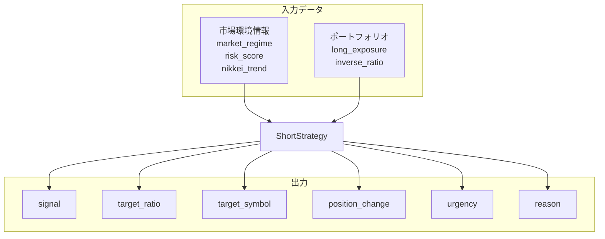

# ショート戦略（インバースETF）：入出力定義

**最終更新**: 2025-12-11

---

## 1. 入力（Input）

### 1.1 必須入力データ

| データ種別 | 具体的なデータ | 形式 | 必須/任意 | 用途 |
|-----------|--------------|------|----------|------|
| **市場レジーム** | market_regime | RegimeType | 必須 | シグナル判定 |
| **リスクスコア** | risk_score | int | 必須 | ヘッジ判断 |
| **日経トレンド** | nikkei_trend | TrendType | 必須 | 方向性確認 |
| **ロングエクスポージャー** | long_exposure | float | 必須 | ヘッジ比率計算 |
| **現在インバース比率** | current_inverse_ratio | float | 必須 | 追加/解消判断 |

### 1.2 対象銘柄

| 銘柄コード | 名称 | 用途 |
|-----------|------|------|
| **1571** | 日経平均インバース | 主力（1倍、流動性高） |
| 1357 | 日経ダブルインバース | 上級者向け（2倍） |

### 1.3 パラメータ入力

| パラメータ | 型 | デフォルト | 範囲 | 説明 |
|-----------|-----|-----------|------|------|
| max_inverse_ratio | float | 0.30 | 0.20〜0.50 | 最大インバース比率 |
| hedge_threshold | int | 70 | 50〜80 | ヘッジ開始リスクスコア |
| position_change_threshold | float | 0.05 | 0.03〜0.10 | ポジション変更閾値 |

---

## 2. 出力（Output）

### 2.1 出力データ構造

```
ShortStrategyResult
├── signal: BUY / SELL / HOLD
├── target_ratio: float          # 目標インバース比率（0〜0.3）
├── position_change: float       # 変更量（+増加/-減少）
├── target_symbol: str           # 対象ETF（1571）
├── urgency: NORMAL / HIGH / URGENT
└── reason: str                  # 判定理由
```

### 2.2 市場レジーム別目標比率

| 市場環境 | インバース目標比率 |
|---------|------------------|
| PANIC_SELL | 30%（最大） |
| STRONG_DOWNTREND | 25% |
| CORRECTION | 18% |
| VOLATILE_RANGE + 下落 | 13% |
| リスクスコア >= 70 | 10%（ヘッジ） |
| その他 | 0% |

### 2.3 出力利用先

| 出力項目 | 利用先コンポーネント | 利用目的 |
|---------|-------------------|---------|
| signal | 執行管理 | インバースETF注文 |
| target_ratio | ポートフォリオ管理 | 配分調整 |
| urgency | 執行管理 | 注文優先度 |

---

## 3. 入出力関係図



---

## 4. 設定可能パラメータ一覧

| カテゴリ | パラメータ | デフォルト | 説明 |
|---------|-----------|-----------|------|
| **配分** | max_inverse_ratio | 0.30 | 最大インバース比率 |
| | hedge_threshold | 70 | ヘッジ開始リスクスコア |
| **シグナル** | position_change_threshold | 0.05 | ポジション変更閾値 |
| **リスク管理** | stop_loss | -5.0% | 損切りライン |
| | take_profit | 10.0% | 利確ライン |
| | max_holding_days | 20 | 最大保有日数 |

---

## 5. 関連ファイル

| 種別 | パス |
|------|------|
| 実装 | `src/domain/services/execution/strategies/short_strategy.py` |
| 設定 | `config/strategies/short_strategy/latest.yml` |
| テスト | `tests/unit/domain/services/execution/strategies/test_short_strategy.py` |

---

**最終更新**: 2025-12-11
