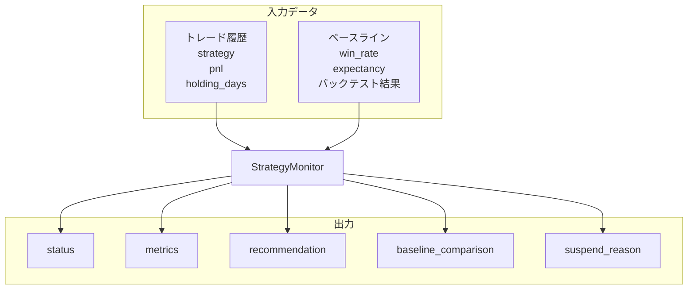

# 戦略劣化検知：入出力定義

**最終更新**: 2025-12-11

---

## 1. 入力（Input）

### 1.1 必須入力データ

| データ種別 | 具体的なデータ | 形式 | 必須/任意 | 用途 |
|-----------|--------------|------|----------|------|
| **戦略名** | strategy_name | str | 必須 | 対象戦略特定 |
| **トレード履歴** | trade_history | List[Trade] | 必須 | メトリクス計算 |
| **ベースライン統計** | baseline_stats | StrategyStats | 必須 | 比較基準 |

### 1.2 トレード履歴（Trade）

```
Trade
├── strategy: str            # 戦略名
├── pnl: float               # 損益（%）
├── holding_days: int        # 保有日数
└── exit_reason: str         # 決済理由
```

### 1.3 パラメータ入力

| パラメータ | 型 | デフォルト | 範囲 | 説明 |
|-----------|-----|-----------|------|------|
| lookback_trades | int | 20 | 10〜50 | 評価対象トレード数 |
| min_trades | int | 10 | 5〜20 | 最小評価トレード数 |
| win_rate_suspend | float | 0.30 | 0.20〜0.40 | 停止閾値（勝率） |
| expectancy_suspend | float | 0.0 | -2.0〜0.0 | 停止閾値（期待値%） |
| win_rate_warning_diff | float | -0.15 | -0.20〜-0.10 | 警告閾値（ベースライン比） |
| consecutive_loss_warning | int | 5 | 3〜7 | 連続損失警告 |
| recovery_trades | int | 10 | 5〜15 | 復帰確認トレード数 |

---

## 2. 出力（Output）

### 2.1 出力データ構造

```
StrategyMonitorResult
├── strategy_name: str               # 戦略名
├── status: ACTIVE / WARNING / SUSPENDED
├── metrics: {
│     win_rate: float,
│     expectancy: float,
│     profit_factor: float,
│     max_consecutive_loss: int,
│     trade_count: int
│   }
├── baseline_comparison: {
│     win_rate_diff: float,
│     expectancy_diff: float,
│     is_degraded: bool
│   }
├── recommendation: str              # 推奨アクション
└── suspend_reason: str | None       # 停止理由
```

### 2.2 ステータス判定基準

| ステータス | 条件 |
|-----------|------|
| SUSPENDED | 勝率 < 30% or 期待値 < 0% or 連続損失 >= 7 |
| WARNING | 勝率がベースライン比-15%以上低下 or 連続損失 >= 5 |
| ACTIVE | 上記以外 |

### 2.3 復帰条件

```
ペーパートレード10回でベースラインの80%以上の性能
```

### 2.4 出力利用先

| 出力項目 | 利用先コンポーネント | 利用目的 |
|---------|-------------------|---------|
| status | 戦略セレクター | 停止戦略の除外 |
| metrics | ポジションサイジング | Kelly係数の入力 |
| recommendation | 日次レポート | 運用者への通知 |

---

## 3. 入出力関係図



---

## 4. 設定可能パラメータ一覧

| カテゴリ | パラメータ | デフォルト | 説明 |
|---------|-----------|-----------|------|
| **評価** | lookback_trades | 20 | 評価対象トレード数 |
| | min_trades | 10 | 最小評価トレード数 |
| **停止** | win_rate_suspend | 0.30 | 停止閾値（勝率） |
| | expectancy_suspend | 0.0 | 停止閾値（期待値%） |
| **警告** | win_rate_warning_diff | -0.15 | 警告閾値（ベースライン比） |
| | consecutive_loss_warning | 5 | 連続損失警告 |
| **復帰** | recovery_trades | 10 | 復帰確認トレード数 |

---

## 5. 関連ファイル

| 種別 | パス |
|------|------|
| 実装 | `src/domain/services/management/strategy_monitor.py` |
| 設定 | `config/strategy_monitor/latest.yml` |
| テスト | `tests/unit/domain/services/management/test_strategy_monitor.py` |

---

**最終更新**: 2025-12-11
