# スウィングトレードシステム コンポーネント検証ガイド

**最終更新**: 2025-12-02

---

## 1. 概要

本ドキュメントでは、スウィングトレードシステムの12の構成要素それぞれの検証方法を定義する。
各要素のパラメータ最適化と、全体としてのパフォーマンス向上を目的とする。

### 関連ドキュメント
- [アーキテクチャ・処理フロー](./architecture-flow.md)

---

## 2. 検証の階層構造

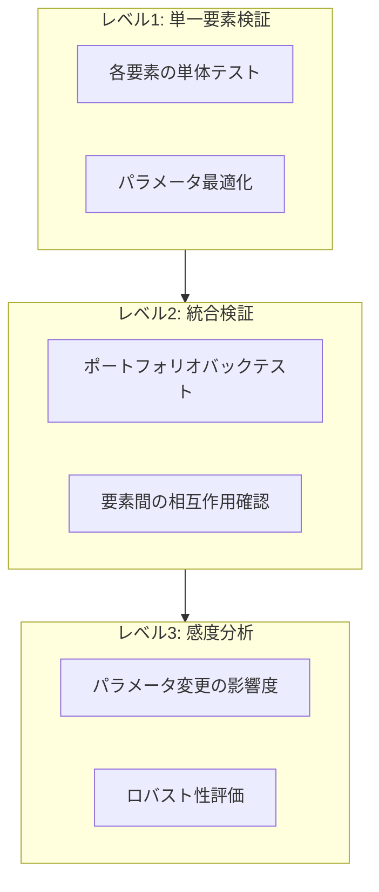

| レベル | 目的 | 検証内容 |
|--------|------|---------|
| レベル1 | 単一要素検証 | 各要素が正しく機能するか、最適なパラメータは何か |
| レベル2 | 統合検証 | 全要素を組み合わせた実運用シミュレーション |
| レベル3 | 感度分析 | パラメータ変更が全体パフォーマンスに与える影響 |

---

## 3. 各要素の検証方法

### 3.1 市場レジーム分析

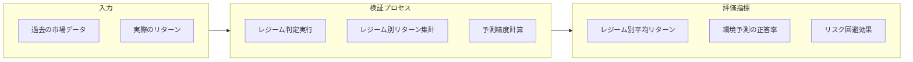

| 項目 | 内容 |
|------|------|
| **検証方法** | 過去データでレジーム判定し、各レジームでのリターンを比較 |
| **評価指標** | レジーム別平均リターン、PANIC_SELL時の損失回避率 |
| **パラメータ** | ADX閾値、SMA期間、ATR%閾値、騰落レシオ期間 |
| **期待効果** | 高リスク環境でのエントリー回避による損失軽減 |

**検証クエリ例**:
```
レジーム = PANIC_SELL の期間にエントリーした場合の平均リターン
vs
レジーム = STABLE_UPTREND の期間にエントリーした場合の平均リターン
```

---

### 3.2 銘柄プロファイル

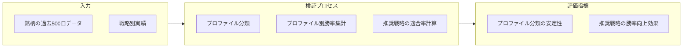

| 項目 | 内容 |
|------|------|
| **検証方法** | プロファイル別に推奨戦略の勝率と全戦略平均を比較 |
| **評価指標** | 推奨戦略の勝率 - 非推奨戦略の勝率、分類安定性 |
| **パラメータ** | ATR%閾値、ADX閾値、反転率閾値、lookback日数 |
| **期待効果** | 銘柄特性に合った戦略選択による勝率向上 |

**検証クエリ例**:
```
プロファイル = HIGH_VOL_TRENDER の銘柄に対して:
  - trend_follow 戦略の勝率
  - mean_reversion 戦略の勝率（推奨外）
→ 推奨戦略の勝率が有意に高いか検証
```

---

### 3.3 イベントカレンダー

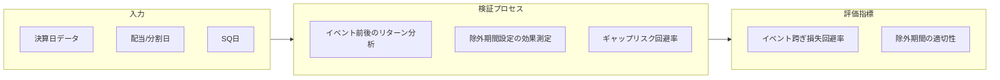

| 項目 | 内容 |
|------|------|
| **検証方法** | 決算跨ぎポジションのリターンと非跨ぎを比較 |
| **評価指標** | 決算ギャップによる損失回避率、除外による機会損失 |
| **パラメータ** | 決算前除外日数、決算後再開日数、SQ前除外日数 |
| **期待効果** | 大きなギャップダウンリスクの回避 |

**検証クエリ例**:
```
決算発表日を跨いで保有したポジションの平均リターン
vs
決算前に手仕舞いしたポジションの平均リターン
→ 除外ルールの有効性を検証
```

---

### 3.4 銘柄ユニバース

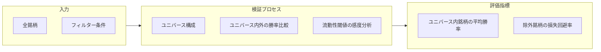

| 項目 | 内容 |
|------|------|
| **検証方法** | ユニバース内銘柄 vs 除外銘柄のパフォーマンス比較 |
| **評価指標** | ユニバース内平均勝率、除外銘柄の損失率 |
| **パラメータ** | 流動性閾値（売買代金）、価格範囲、データ品質閾値 |
| **期待効果** | 流動性不足・データ品質問題による損失回避 |

**検証クエリ例**:
```
流動性閾値 = 70M円 で除外された銘柄群の平均リターン
vs
ユニバース採用銘柄の平均リターン
```

---

### 3.5 銘柄スクリーニング

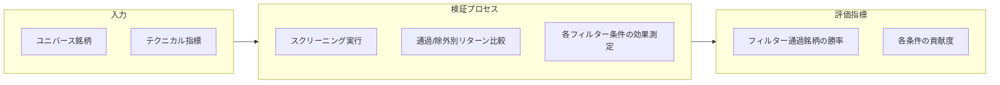

| 項目 | 内容 |
|------|------|
| **検証方法** | フィルター条件の有無でパフォーマンス比較 |
| **評価指標** | フィルター通過銘柄の勝率、各条件の除外効果 |
| **パラメータ** | ADX閾値、RSI範囲、ATR%範囲、出来高比率閾値 |
| **期待効果** | 不適切な銘柄の除外による勝率向上 |

**検証クエリ例**:
```
RSI > 70 で除外された銘柄のその後のリターン
→ 除外が正しかったか（損失回避できたか）検証
```

---

### 3.6 戦略セレクター

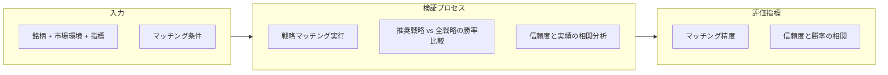

| 項目 | 内容 |
|------|------|
| **検証方法** | マッチした戦略の勝率と全戦略平均を比較 |
| **評価指標** | 推奨戦略の勝率向上幅、信頼度と実績の相関 |
| **パラメータ** | 各戦略のマッチング条件、信頼度閾値 |
| **期待効果** | 状況に適した戦略選択による勝率向上 |

**検証クエリ例**:
```
戦略セレクターが trend_follow を推奨した場合:
  - trend_follow の勝率
  - 他戦略（mean_reversion等）の勝率
→ 推奨戦略が最適だったか検証
```

---

### 3.7 戦略実行


| 項目 | 内容 |
|------|------|
| **検証方法** | 戦略別バックテスト（strategy_backtester.py） |
| **評価指標** | 勝率、平均リターン、期待値、シャープレシオ、最大DD |
| **パラメータ** | エントリー条件、SL/TP倍率、max_holding_days |
| **期待効果** | 各戦略の期待値がプラスであること |

**検証コマンド例**:
```bash
stock-cli swing backtest 7453.T --strategy trend_follow --start-date 2024-01-01
```

---

### 3.8 ポジションサイジング

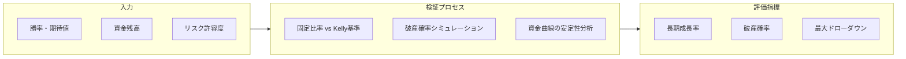

| 項目 | 内容 |
|------|------|
| **検証方法** | 異なるサイジング手法での資金推移シミュレーション |
| **評価指標** | CAGR、破産確率、最大DD、シャープレシオ |
| **パラメータ** | risk_per_trade_pct、Kelly係数、最大ポジション比率 |
| **期待効果** | 長期的な資金成長の最大化とリスク管理 |

**検証クエリ例**:
```
固定2%リスク vs Kelly × 0.5 vs Kelly × 0.25
→ 10年シミュレーションでの最終資金・最大DD比較
```

---

### 3.9 リスク管理

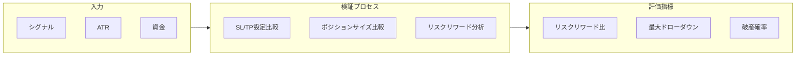

| 項目 | 内容 |
|------|------|
| **検証方法** | SL/TP設定のバリエーションでバックテスト比較 |
| **評価指標** | リスクリワード比、最大DD、勝率×平均利益 |
| **パラメータ** | SL ATR倍率、TP ATR倍率、risk_per_trade_pct |
| **期待効果** | 最大DDの抑制、長期的な資金成長 |

**検証クエリ例**:
```
SL = 1.5×ATR vs SL = 2.0×ATR vs SL = 2.5×ATR
→ 勝率、平均リターン、最大DDの比較
```

---

### 3.10 執行管理

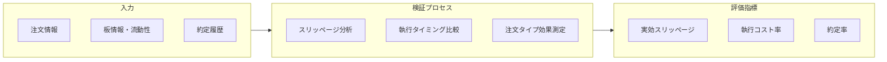

| 項目 | 内容 |
|------|------|
| **検証方法** | 想定約定価格と実約定価格の差分分析 |
| **評価指標** | 平均スリッページ、執行コスト率、フィルレート |
| **パラメータ** | 注文タイプ、指値オフセット、分割執行比率 |
| **期待効果** | 執行コストの最小化、約定確実性の向上 |

**検証クエリ例**:
```
成行注文 vs 寄付指値 vs 前日終値±0.5%指値
→ 約定率とスリッページの比較
```

---

### 3.11 ポートフォリオ管理

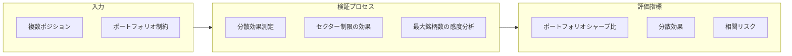

| 項目 | 内容 |
|------|------|
| **検証方法** | ポートフォリオバックテストで分散効果を測定 |
| **評価指標** | ポートフォリオシャープ比、銘柄間相関、最大DD |
| **パラメータ** | max_positions、セクター上限、現金準備率 |
| **期待効果** | 分散によるリスク低減、安定したリターン |

**検証コマンド例**:
```bash
stock-cli swing portfolio-backtest --max-positions 10 --start-date 2024-01-01
stock-cli swing portfolio-backtest --max-positions 20 --start-date 2024-01-01
→ 比較
```

---

### 3.12 パフォーマンス評価

| 項目 | 内容 |
|------|------|
| **検証方法** | N/A（計測側のため検証対象外） |
| **評価指標** | 計算精度の確認（単体テスト） |
| **パラメータ** | なし |
| **備考** | 計算ロジックの正確性は単体テストで担保 |

---

## 4. 統合検証フロー

全要素を組み合わせた検証は、ポートフォリオバックテストで実施する。

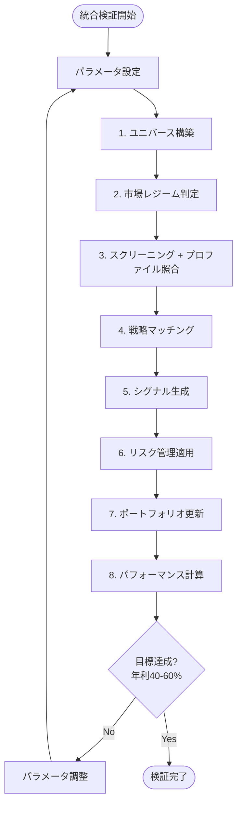

### 統合検証の評価指標

| 指標 | 目標値 | 説明 |
|------|-------|------|
| 年間リターン | 40-60% | 目標収益率 |
| 最大ドローダウン | < 20% | リスク許容範囲 |
| シャープレシオ | > 1.5 | リスク調整後リターン |
| 勝率 | > 50% | 勝ちトレードの割合 |
| プロフィットファクター | > 1.5 | 総利益 / 総損失 |

---

## 5. パラメータ最適化手順

### 5.1 最適化の順序

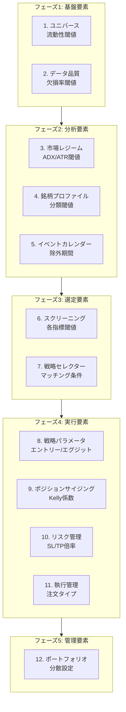

### 5.2 最適化の注意点

| 注意点 | 説明 |
|--------|------|
| **過学習回避** | アウトオブサンプルデータでの検証必須 |
| **パラメータ依存** | 上流の変更が下流に影響するため、順序を守る |
| **市場環境変化** | 複数期間での検証でロバスト性確認 |
| **計算コスト** | グリッドサーチは範囲を絞って実施 |

### 5.3 推奨アプローチ

1. **粗い探索**: パラメータを大きく変化させて傾向把握
2. **細かい探索**: 有望な範囲で詳細探索
3. **アウトオブサンプル検証**: 別期間データで確認
4. **感度分析**: 最適値周辺でのロバスト性確認

---

## 6. 検証結果の記録

検証結果は以下の形式で記録することを推奨:

```yaml
# config/validation_results/YYYY-MM-DD_component_name.yml
validation:
  component: market_regime
  date: 2025-12-01
  parameters:
    adx_trending_threshold: 25
    atr_elevated_threshold: 3.0
  results:
    sample_period: 2024-01-01 to 2024-12-31
    metrics:
      regime_accuracy: 0.72
      panic_avoidance_rate: 0.85
      avg_return_by_regime:
        STABLE_UPTREND: 0.032
        PANIC_SELL: -0.045
  notes: |
    ADX閾値を25から20に下げると、レンジ相場の検出精度が向上するが
    トレンド相場での誤判定が増加
```

---

**最終更新**: 2025-12-02
